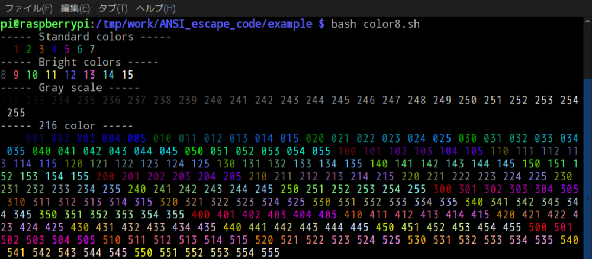
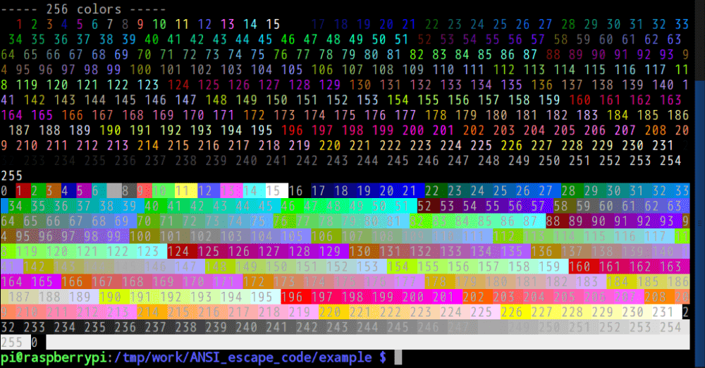

# このソフトウェアについて

シェルで色を変える。echo, PS1。

# 参考

* https://en.wikipedia.org/wiki/ANSI_escape_code
* https://qiita.com/HMMNRST/items/d8fe7b3c528f447d68a6

# 開発環境

* [Raspberry Pi](https://ja.wikipedia.org/wiki/Raspberry_Pi) 3 Model B
    * [Raspbian](https://www.raspberrypi.org/downloads/raspbian/) GNU/Linux 8.0 (jessie)
        * [pyenv](http://ytyaru.hatenablog.com/entry/2019/01/06/000000)
            * Python 3.6.4

# ライセンス

このソフトウェアはCC0ライセンスである。

利用ライブラリは以下。

Library|License|Copyright
-------|-------|---------
[dataset](https://dataset.readthedocs.io/en/latest/)|[MIT](https://opensource.org/licenses/MIT)|[Copyright (c) 2013, Open Knowledge Foundation, Friedrich Lindenberg, Gregor Aisch](https://github.com/pudo/dataset/blob/master/LICENSE.txt)
[SQLAlchemy](https://www.sqlalchemy.org/)|[MIT](https://opensource.org/licenses/MIT)|[Mike Bayer](https://pypi.python.org/pypi/SQLAlchemy/1.2.2)

